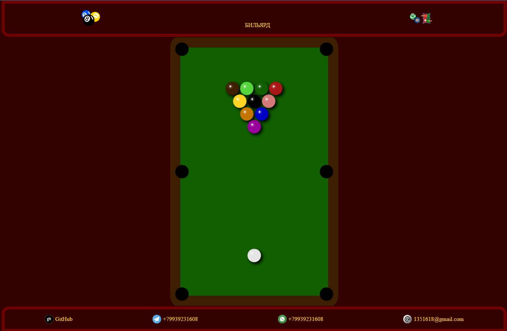

# Бильярд

---

## Инструкции по установке и запуску проекта

1. **Склонируйте репозиторий**

   ```bash
   git clone <URL_репозитория>
   ```

2. **Подгрузите зависимости**

   ```bash
   npm install
   ```

3. **Запустите проект**

   ```bash
   npm run dev
   ```

## Действия

- С зажатой левой клавишей мыши плавно подвигайте курсор к шару.
- Нажмите на центр шара, чтобы выбрать его цвет.

Пожалуйста, следуйте этим инструкциям для установки и запуска проекта. Приятного использования!

---


